## 计算机毕业设计Python+Django农产品推荐系统 农产品爬虫 农产品商城 农产品大数据 农产品数据分析可视化 PySpark Hadoop Hive Hadoop PySpark 机器学习 深度学习 Python Scrapy分布式爬虫 机器学习 大数据毕业设计 数据仓库 大数据毕业设计 文本分类 LSTM情感分析 大数据毕业设计 知识图谱 大数据毕业设计 预测系统 实时计算 离线计算 数据仓库 人工智能 神经网络

## 要求
### 源码有偿！一套(论文 PPT 源码+sql脚本+教程)

### 
### 加好友前帮忙start一下，并备注github有偿纯python农产品
### 我的QQ号是2827724252或者798059319或者 1679232425或者微信:bysj2023nb 或bysj1688

# 

### 加qq好友说明（被部分 网友整得心力交瘁）：
    1.加好友务必按照格式备注
    2.避免浪费各自的时间！
    3.当“客服”不容易，repo 主是体面人，不爆粗，性格好，文明人。

演示视频
https://www.bilibili.com/video/BV1zx4y1J7Ud/?spm_id_from=333.999.0.0

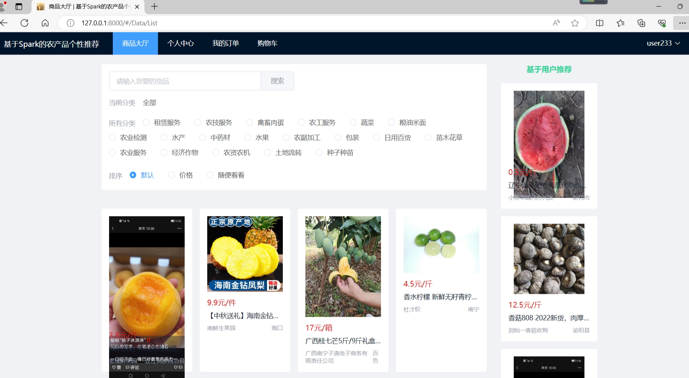
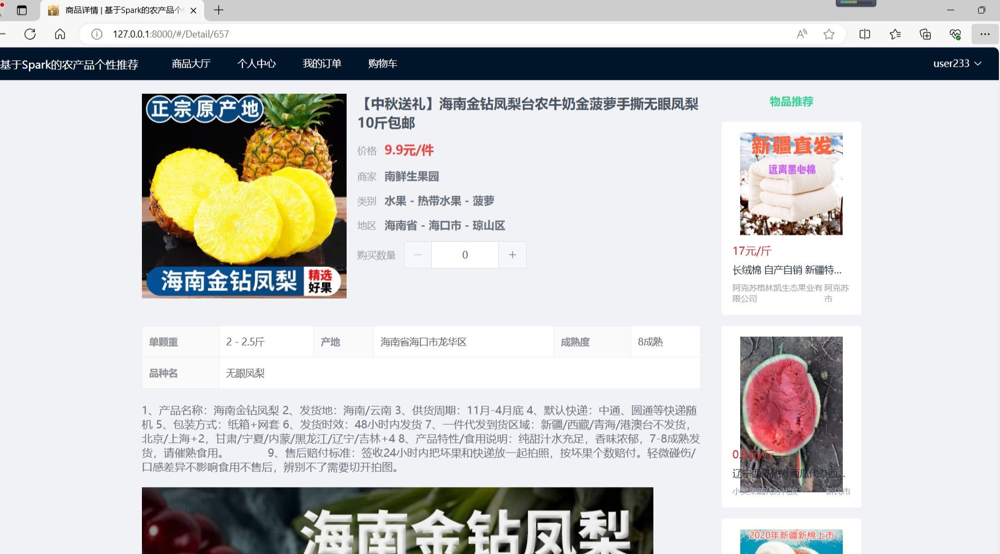
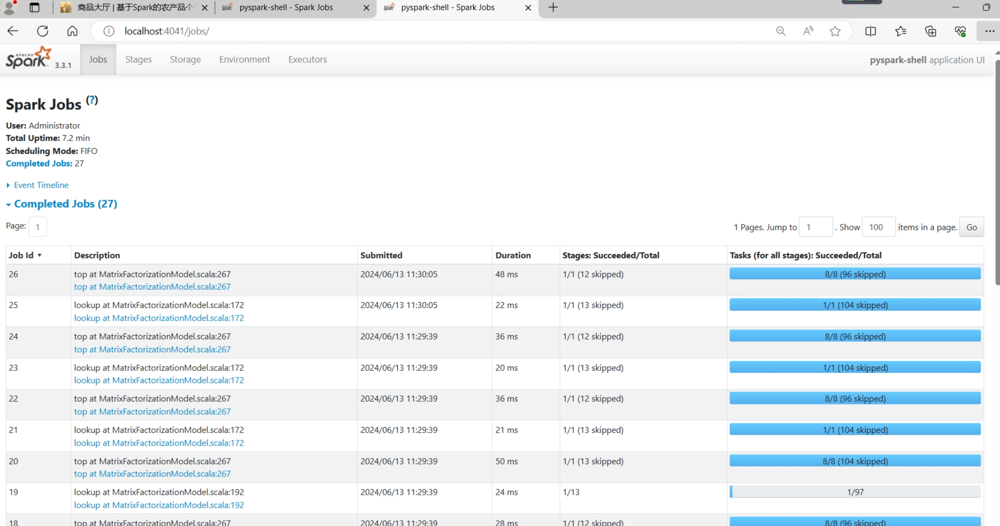
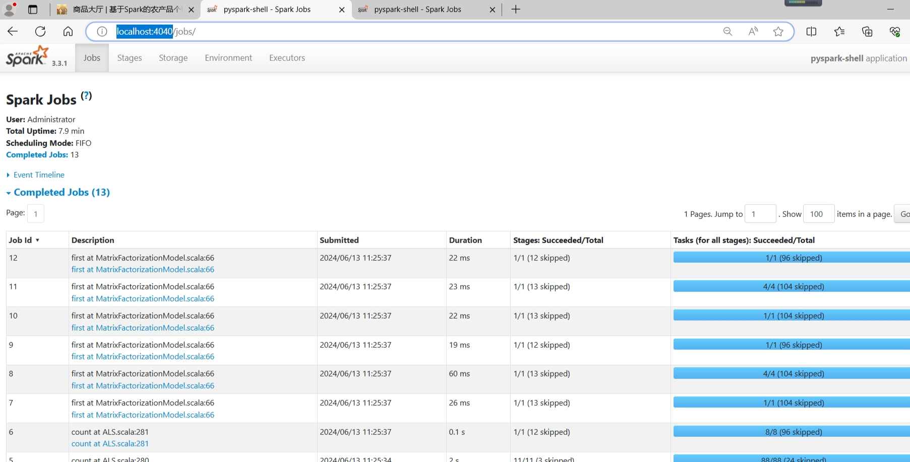
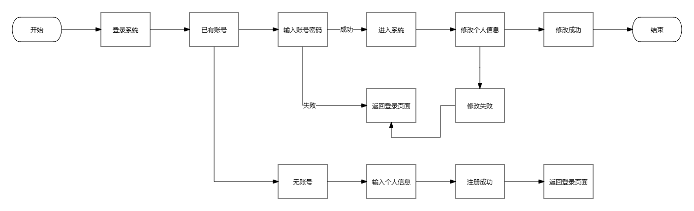

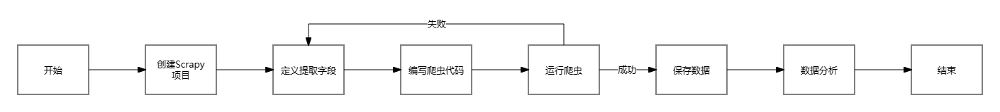
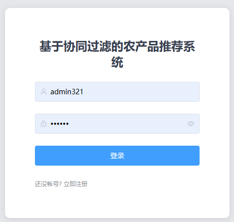
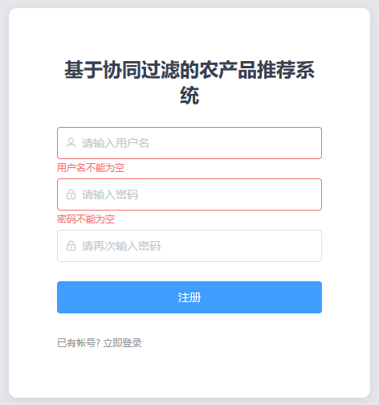
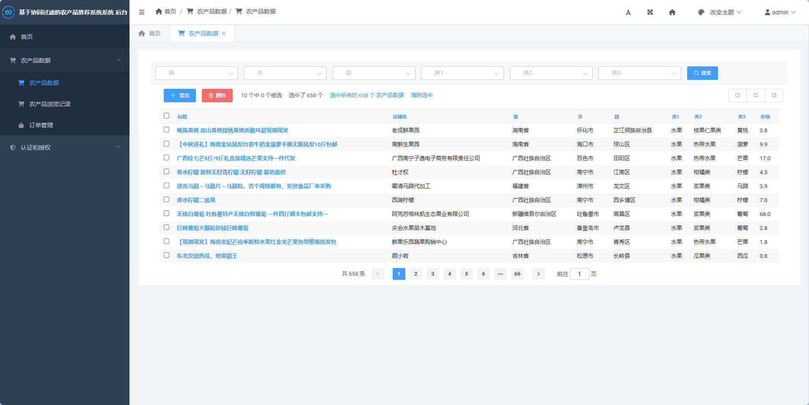
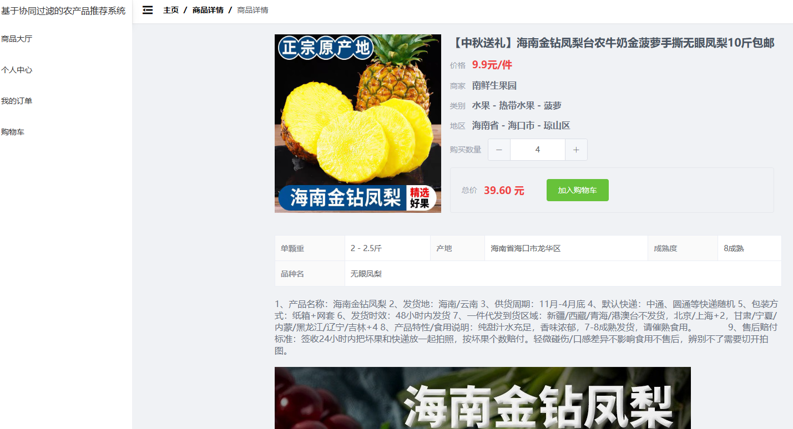
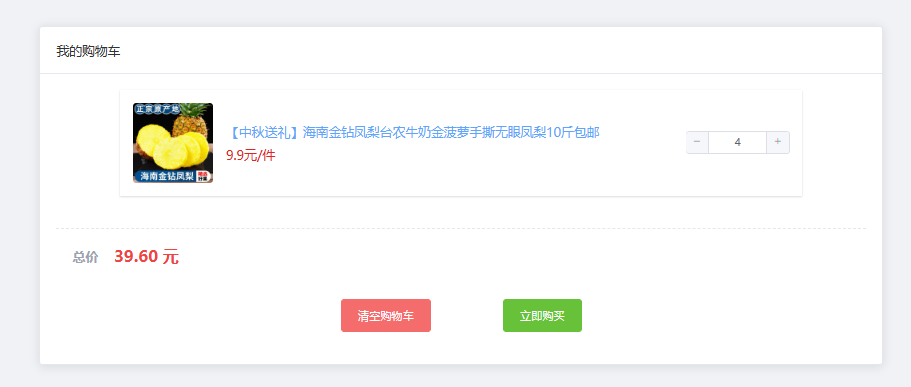
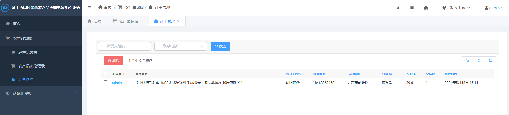
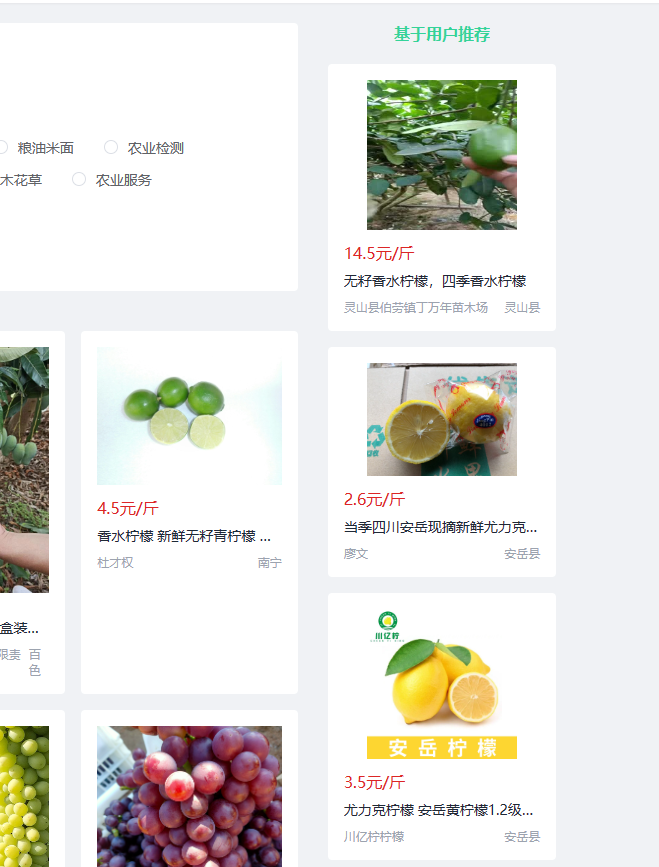
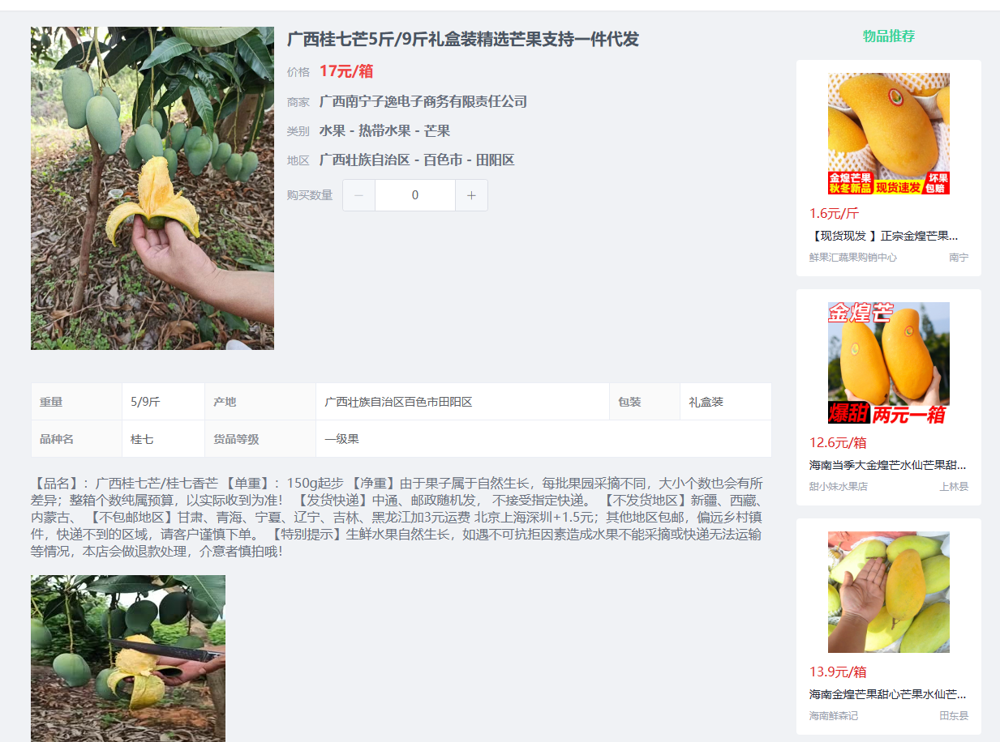
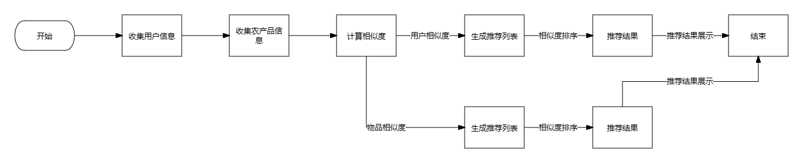
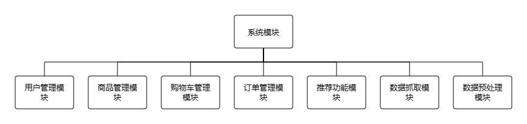
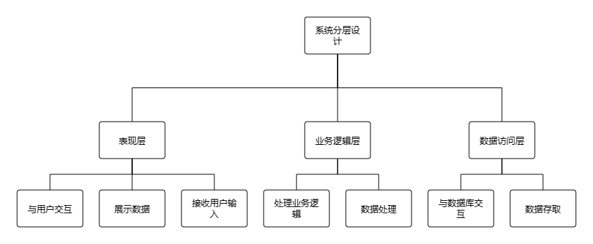

## 开发技术：
基于Spark的农产品个性推荐系统

相关技术介绍:
    1. Python

    Python是一种高级编程语言，具有简洁、易读、易学的特点，被广泛应用于Web开发、数据分析、人工智能等领域。

    在此系统中，我们使用Python进行后端开发，利用其强大的语法特性和丰富的第三方库，实现了各个模块（如商品、用户、购物车等）的业务逻辑。

    2. PySpark

    PySpark是Apache Spark的Python API，它支持Spark提供的所有功能，包括分布式数据处理、机器学习、图形处理等，具有高效、快速的数据处理能力。

    在此系统中，我们使用PySpark进行数据处理和分析，例如利用Spark SQL查询数据库中的数据，或通过Spark Streaming实时处理用户行为数据。

    3. Hadoop

    Hadoop是一种开源的分布式计算框架，它支持处理大规模数据集，具有高可靠性和可扩展性。

    在此系统中，我们使用Hadoop进行数据存储和分布式计算，例如将大量的用户浏览行为数据存储到HDFS文件系统中，并通过MapReduce框架进行并行计算。

    4. Django

    Django是一种用于Web应用程序开发的高级Python Web框架，它具有ORM、模板渲染、路由分发等一系列功能，可以快速构建高质量的Web应用程序。

    在此系统中，我们采用Django作为后端开发框架，通过其提供的功能，轻松实现了各个业务模块的开发和管理，例如商品、用户、购物车等。

    5. Scrapy

    Scrapy是一种Python编写的爬虫工具，它支持异步网络请求和数据解析，可以从网站上抓取大量的结构化数据。

    在此系统中，我们使用Scrapy进行数据采集，例如从多个电商网站抓取商品信息，并存储到数据库中，以供系统进行商品推荐和展示。

    6. Vue

    Vue.js是一种前端JavaScript框架，支持组件化开发和模板渲染，使得前端开发更加易用和高效。

    在此系统中，我们采用Vue.js作为前端开发框架，通过其提供的功能，实现了整个系统的前端交互和视觉设计，例如商品展示、购物车管理等。

    7. Element Plus

    Element Plus是一种基于Vue.js的组件库，它包含了一系列美观、易用的UI组件和样式，可以简化前端开发过程。

    在此系统中，我们使用Element Plus作为前端UI框架，利用其提供的组件，快速构建了购物车界面和登陆界面，并提升了系统的用户体验。

系统的实现可以分为以下七个模块：
    1. 数据抓取模块

    这个模块的主要任务是从“惠农网”采集数据，并将其存储至数据库及Hadoop分布式文件系统中。我们采用了Scrapy作为爬虫框架，通过编写Python代码实现自动化抓取数据。由于许多网站保护自己而对爬虫采取了反爬手段，因此我们必须采取一些措施来绕过这些限制，例如设置代理、更换User-Agent等。抓取到的数据包括商品信息（如名称、图片、价格、类别等）。

    2. 数据预处理模块

    这个模块的主要任务是对从网络上抓取的原始数据进行清洗、去重、规范化和归一化，以方便后续处理。首先，我们需要去掉HTML标签、特殊字符等无用信息，并将数据统一编码为UTF-8格式。然后，我们可以通过一些方法（如Levenshtein距离、余弦相似度等）补全缺失或错误的信息，并进行数据去重和数据匹配等操作，最后将数据转换成适合接下来的算法使用的格式（如行列表示或稀疏矩阵表示）。

    3. 推荐算法模块

    这个模块的主要任务是根据用户历史浏览行为和购买记录，计算不同用户之间之间的相似度，并基于该相似度来推荐相似的农产品给用户。我们使用Apache Spark的MLlib库实现了协同过滤算法，通过训练模型，生成一个可以对用户进行准确预测的模型。具体来说，我们使用了Spark中的Alternating Least Squares (ALS)算法，用该算法可实现基于用户推荐与基于物品推荐，算法首先将用户id、商品id以及浏览量评分作为输入，然后输出商品相似度矩阵，矩阵中的每个元素代表两个商品之间的相似度。这样可以最大程度地发掘用户的潜在需求，提高农产品的销售量和用户粘性。

    4. 推荐模块

    这个模块是整个推荐系统的核心，主要负责将推荐算法的结果展示给用户。当用户浏览商品时，系统会根据用户的历史浏览行为和购买记录，向用户推荐相关的农产品。推荐模块采用Vue.js和Element UI等技术框架构建前端UI界面，通过Ajax技术从后台获取推荐数据。

    5. 用户管理模块

    这个模块主要是提供用户注册、登录、个人信息管理等服务。我们使用Django框架实现了用户管理模块，并将用户信息存储在数据库中。此外，为了保证用户信息的安全性，我们还需要对输入数据进行有效性验证和校验。用户管理模块的目标是提供方便的用户管理服务，增强用户的黏性和满意度。

    6. 商品管理模块

    这个模块主要是提供管理员操作的义务，用于管理农产品的相关信息，包括基本信息、价格、分类、数量等。我们使用Django框架实现商品管理模块，并将商品信息存储在数据库中。此外，对于上架的农产品信息，我们可以在后台进行审核和下架处理，确保商品的质量和安全性。商品管理模块的目标是提供高效、精准的商品管理服务，增加商品的销售量和用户评价。

    7. 购物车和订单模块

    这个模块主要涉及到购物车和订单管理，包括加入购物车、付款等全流程。我们使用Django框架实现购物车和订单模块，并将购物车信息和订单信息存储在数据库中。购物车和订单模块的目标是提供完整的购物体验和售后服务，增强用户的购买快感和满意度。

综上所述，基于Spark的农产品个性化推荐系统涉及到多个方面，需要结合多种技术和框架进行开发和实现。每个模块都仔细设计和实现，以确保系统的高效性、准确性、安全性和易用性。

技术及功能关键词:
    python pyspark hadoop django scrapy vue element-plus 协同过滤算法 
    通过scrapy爬虫框架抓取“惠农网”网站上的农产品数据 
    前台用户通过登陆注册后进入系统
    用户可在个人中心修改基本信息，其包括收货人姓名、收货地址及联系电话，也可以修改密码 
    管理员可在后台管理各类农产品数据 
    在商品大厅模块中，在模块页面的左侧，用户可以通过农产品关键词或农产品分类等条件筛选符合要求的农产品，也可以通过默认、价格、随便看看等排序条件对产品进行排序；在模块页面的右侧，系统会通过基于用户的协同过滤算法推荐用户5个农产品
    当用户浏览某个农产品的详情页面时，系统会展示农产品的标题、产品图片、价格、商家、类别、地区、产品参数以及产品详情介绍等基本信息，同时在页面的右侧，系统会通过基于物品的协同过滤算法推荐用户5个相关的农产品
    当用户浏览某个农产品的详情页面时，用户可将其加入购物车，在购物车页面可以将所有农产品一并结算购买，当填写完收货人姓名、收货地址及联系电话等信息后，加入订单信息，随后可在我的订单模块查看历史所有的订单

目录结构(只关注标注了中文的):
    ├── README.md
    ├── auth 用户登陆注册模块
    │   ├── __init__.py
    │   ├── admin.py
    │   ├── apps.py
    │   ├── migrations
    │   │   ├── 0001_initial.py
    │   │   └── __init__.py
    │   ├── models.py
    │   ├── tests.py
    │   ├── urls.py
    │   └── views.py 登陆注册/修改密码/修改个人信息的代码！
    ├── bs-frontend-template
    │   ├── LICENSE
    │   ├── encrypt.js
    │   ├── index.html
    │   ├── jest.config.js
    │   ├── mock
    │   │   ├── data
    │   │   ├── index.ts
    │   │   ├── mockProdServer.ts
    │   │   └── response.ts
    │   ├── package-lock.json
    │   ├── package.json
    │   ├── public
    │   ├── src
    │   │   ├── App.vue
    │   │   ├── api
    │   │   ├── assets
    │   │   ├── components
    │   │   ├── config
    │   │   ├── directive
    │   │   ├── icons
    │   │   ├── layout
    │   │   ├── main.ts
    │   │   ├── mixin
    │   │   ├── permission.ts
    │   │   ├── router
    │   │   ├── store
    │   │   ├── type
    │   │   ├── utils
    │   │   └── views 前端源代码，前台所有页面的代码都在这！！！
    │   ├── tailwind.config.js
    │   ├── test
    │   │   ├── components
    │   │   └── utils
    │   ├── tsconfig.json
    │   └── vite.config.ts
    ├── db.sqlite3
    ├── dist
    │   ├── assets
    │   │   ├── 401.769d53ed.js
    │   │   ├── 401.a61ddb94.gif
    │   │   ├── 401.c2a2c7c5.css
    │   │   ├── 404.538aa4d7.png
    │   │   ├── 404.5ca2d44b.js
    │   │   ├── 404.7b2a8f99.css
    │   │   ├── 404_cloud.98e7ac66.png
    │   │   ├── Login.88979abb.js
    │   │   ├── Login.99cfb354.css
    │   │   ├── Register.43a03aeb.css
    │   │   ├── Register.4b671ac5.js
    │   │   ├── action.04923800.js
    │   │   ├── blank.72499d02.js
    │   │   ├── echarts.7b83cee2.js
    │   │   ├── element-icons.9c88a535.woff
    │   │   ├── element-icons.de5eb258.ttf
    │   │   ├── element-plus.6676f87e.js
    │   │   ├── formExtend.64ea3fc7.js
    │   │   ├── format.d52b9cd4.js
    │   │   ├── icon.51fd296d.png
    │   │   ├── index.033ad819.js
    │   │   ├── index.25654c29.css
    │   │   ├── index.3113e28f.js
    │   │   ├── index.421e0f7d.css
    │   │   ├── index.5469c60f.js
    │   │   ├── index.84fbaef0.css
    │   │   ├── index.8e0381e8.css
    │   │   ├── index.af418062.js
    │   │   ├── index.b80ed4b4.js
    │   │   ├── index.c87f29a1.js
    │   │   ├── index.db1c9c90.js
    │   │   ├── index.e590e563.js
    │   │   ├── index.f6141f0a.css
    │   │   ├── index.fe77f519.css
    │   │   ├── pinyin.889e0d93.js
    │   │   └── redirect.136154af.js
    │   └── index.html
    ├── index
    │   ├── __init__.py
    │   ├── admin.py
    │   ├── apps.py
    │   ├── migrations
    │   │   └── __init__.py
    │   ├── models.py
    │   ├── tests.py
    │   ├── urls.py
    │   ├── utils.py
    │   └── views.py
    ├── manage.py
    ├── middlewares
    │   └── __init__.py
    ├── produce 农产品数据后端最重要的模块！！！
    │   ├── __init__.py
    │   ├── admin.py 后台显示数据的配置
    │   ├── apps.py 协同过滤算法代码！！！
    │   ├── migrations
    │   │   └── __init__.py
    │   ├── models.py 数据库的各个表模型
    │   ├── tests.py
    │   ├── urls.py
    │   └── views.py 农产品相关所有重要的后端代码！！！！！
    ├── produce_recommand
    │   ├── __init__.py
    │   ├── asgi.py
    │   ├── settings.py 后端配置文件
    │   ├── urls.py 路由配置文件
    │   └── wsgi.py
    ├── requirements.txt
    ├── scrapy.cfg
    ├── spider
    │   ├── __init__.py
    │   ├── items.py
    │   ├── middlewares.py
    │   ├── pipelines.py 爬虫数据入库逻辑
    │   ├── settings.py
    │   └── spiders
    │       ├── __init__.py
    │       └── hnw.py 爬虫代码！！！
    └── 项目介绍.txt
	
1.课题研究的意义，国内外研究现状、水平和发展趋势
1.1研究意义
21世纪是一个信息爆炸的时代，人们在日常生活中可接触到的信息量非常之巨大。推荐系统逐步发展，其中又以个性化推荐系统最为瞩目。个性化推荐系统的核心在于个性化推荐算法，该算法不需要用户提供明确的需求，而是使用从用户那里收集到的各种信息作为特征，进而为用户建立个性化的偏好模型，最终把满足个人品味和需求的信息推荐给用户。
随着国内电商环境的进一步升温，农产品电子商务的发展已然颇具雏形，尤其2020年初受新冠疫情影响，在大型的聚集活动和线下采购活动皆难以正常运转的情况下，农产品电商的无接触式线上销售模式，由于避免了人与人之间的直接接触，降低了用户感染的风险，因而受到了消费者的广泛关注，农产品电商的发展迎来了新的机遇。农产品电商正逐步成为继图书、电子产品、生活用品等之后的新的经济创收点，特别是在中央一号文件的推动下，以农产品为核心的农村电商成为了重头戏，越来越受到消费者的青睐，农产品电商的发展迎来了春天，出现了一大批具有代表性的农产品电商平台，比如顺丰优选、易果生鲜、惠农网等。与此同时，我国电商市场的竞争越来越激烈，各种各样的产品映入人们的眼帘，由最开始的淘宝、天猫等电子商务网站到现在各种类型的电子商务网站，例如农资电商网站——惠农网、旅游电商网站——驴妈妈以及跨境电商网站——网易考拉海购、洋码头等。
然而，由于农产品本身存在一些特有的属性，现有的传统电商常规产品推荐技术并不能完全适用于农产品推荐，往往造成推荐精度不高的现象，不能很好地满足用户的需求。另外，对于目前所存在的一些农产品电商平台，囿于产品的独特性，其扩展速度及规模并不能很好满足消费者的需求。根据商务部商务大数据显示，2021年，东、中、西部和东北地区农村网络零售额占全国农村网络零售额比重分别为77.9%、14.1%、6.4%和1.6%，同比增速分别为8.1%、9.1%、15.8%和21.5%。可见我国农产品电商平台具有发展潜力巨大，发展方向欣欣向荣，以及发展相对不平衡的特点。
基于以上分析，本文提出了基于协同过滤的农产品推荐系统来实现对于农产品的个性化推荐功能，以满足用户需求。
1.2国内外发展现状
1.2.1国外现状
国外农产品在线交易系统在过去五年里经历了显著的发展和变革。随着互联网技术的不断进步和消费者对农产品质量和便利性需求的增加，农产品电商平台在全球范围内迅速崛起。
（1）市场规模
据统计，2019年，全球农产品在线交易市场规模约为128亿美元，预计到2024年将达到356亿美元，年均复合增长率为96%左右。这一增长主要得益于消费者对健康、有机和本地生产的农产品日益关注，以及电商平台在农产品分销和物流方面的创新。
（2）平台类型
国外农产品电商平台类型多样，包括综合性电商平台（如亚马逊、eBay）的农产品专区，专业农产品电商平台（如FreshDirect、HelloFresh），以及社区支持农业（CSA）模式等。这些平台通过提供从农场到餐桌的直接交易服务，缩短了农产品供应链，降低了成本，提高了效率。
（3）技术应用
在技术应用方面，大数据、人工智能、物联网等先进技术被广泛应用于农产品在线交易系统。例如，通过大数据分析用户购买行为和偏好，电商平台可以实现精准推荐，提高销售额。同时，物联网技术可以实时监测农产品的生长环境和质量，确保产品的安全和品质。
（4）个性化推荐
随着消费者对个性化服务的需求增加，农产品电商平台将更加注重个性化推荐技术的应用。通过分析用户的历史购买记录、浏览行为、社交媒体等数据，电商平台可以为用户提供更加精准的农产品推荐，提高用户体验和满意度。
（5）供应链优化
农产品电商平台将继续优化供应链管理，提高物流效率。通过与农民、供应商和物流公司建立紧密合作关系，电商平台可以实现从农场到消费者的快速、准确配送，降低成本，提高客户满意度。
（6）绿色环保
随着环保意识的提高，消费者对农产品的环保属性越来越关注。因此，未来农产品电商平台将更加注重绿色环保理念的推广和实践。通过提供有机、绿色、可持续生产的农产品，电商平台可以吸引更多环保意识强的消费者，提高市场份额。
（7）跨进电商
随着全球化进程的加速和国际贸易的便利化，跨境电商在农产品领域的应用将逐渐增多。通过与国际农产品供应商建立合作关系，电商平台可以为消费者提供更丰富的农产品选择，促进国际贸易的发展。
综上所述，国外农产品在线交易系统在过去五年里取得了显著的发展成果，未来将继续保持强劲的增长势头。随着技术的不断进步和消费者需求的不断变化，农产品电商平台将不断创新和完善，为消费者提供更加优质、便捷的服务。
1.2.2国内现状
（1）市场规模现状
根据市场研究机构的数据显示，全球农产品在线交易市场规模在过去五年内实现了显著增长。从地区分布来看，农产品交易主要集中在东部沿海地区和中部农业大省。这些地区拥有丰富的农业资源和完善的农产品流通体系，为农产品交易提供了有力支撑。同时，随着互联网技术的普及和电子商务的快速发展，农产品线上交易规模也在不断扩大，成为推动农产品交易规模增长的重要力量。据预测，到2025年，全球农产品在线交易市场的规模将达到数千亿美元。

图1-1 2011-2022年中国农产品批发总成交量统计
（2）平台多样化与竞争加剧
目前，线上农产品交易平台众多，包括综合性电商平台、农产品垂直电商以及社交电商等。这些平台通过不同的定位和策略，满足了消费者多样化的购物需求。然而，随着市场的不断扩大，竞争也日益激烈。各大平台纷纷通过优化供应链、提升用户体验、加强品牌营销等手段，争夺市场份额。交易方式创新
（3）农产品品质和安全将成为核心竞争力
随着消费者对农产品品质和安全的关注度不断提高，农产品品质和安全将成为农产品交易的核心竞争力。农产品经营者需要加强质量管理和安全监管，提升产品的品质和安全性，以赢得消费者的信任和青睐。
（4）品质与安全成为关注焦点
线上农产品交易涉及到产品的生产、加工、运输等多个环节，品质与安全问题备受关注。为了保障消费者的权益，各大平台纷纷加强品质监管和安全检测，确保所售农产品的品质和安全。同时，消费者对于农产品的溯源信息也越来越关注，要求平台提供更为透明和详细的产品信息。
综上所述，国内线上农产品交易规模庞大且增长迅速，发展现状积极向好，未来前景广阔。然而，也面临着品质安全、物流配送等方面的挑战。因此，线上农产品交易平台需要不断创新和完善，提升服务质量和用户体验，以适应市场变化并抓住发展机遇。同时，政府和社会各界也应加强支持和引导，共同推动线上农产品市场的健康发展。

(1)能够根据计算机软硬件知识和数学知识给出复杂工程设计的基本思路和解决方案；在考虑社会、健康、安全、法律、文化以及环境等因素下可对设计方案及软硬件系统等在技术、经济等方面进行评价，确认其可行性；
    (2)能够建立软硬件系统、应用数学、自然科学和工程科学的基本原理、通过信息综合来验证解决方案的准确性和合理性，获得有效结论；
    (3)正确选择并能合理应用恰当的技术、工程工具与开发平台完成毕业设计课题的设计、开发、测试，保证所完成的系统在功能和性能上达到任务书规定的要求，具有较好的实用性；
    (4)培养学生能够基于工程相关背景知识合理分析、评价计算机专业工程实践和复杂工程问题解决方案对经济、环境、法律、安全、健康、伦理的影响，并理解应承担的责任；
    (5)能够在多学科背景下理解团队的意义，了解软件项目团队的角色，主动与其他成员沟通、合作、开展工作；能够在团队中承担个体、团队成员以及负责人的角色；
    (6)能够就计算机领域复杂工程问题与行业及社会公众进行有效沟通和交流；能够就功能、技术等相关问题陈述发言、清晰表达；能够用形式化模型和规范的文档等形式呈现软件系统解决方案和成果；能够较正确回答开题答辩、最终答辩中教师提出的相关问题；
    (7)理解工程实践活动中工程管理与经济决策基本知识，并能在多学科环境下应用于计算机工程实践中；
    (8)具有独立分析和解决问题能力，提升自主学习和终身学习的意识。

毕业设计（论文）的内容和要求 ：
〔包括原始数据、技术要求、工作要求等〕
（1）毕业设计（论文）的内容

随着互联网技术的不断发展，电子商务平台在农产品销售领域扮演着越来越重要的角色。消费者对农产品的购买行为逐渐从线下转向线上，这使得农产品电商平台的用户数据呈现出爆炸式增长。如何有效利用这些数据，为用户提供个性化的农产品推荐，成为农产品电商平台亟待解决的问题。因此，本文提出了一种基于Spark协同过滤的农产品个性推荐系统，旨在利用Spark的分布式计算能力，提高推荐系统的计算效率和准确性。系统实现以下的内容：

1) 游客登陆功能

前台用户通过注册并登陆后进入系统，用户可以在个人中心修改基本信息，其包括收货人姓名、收货地址及联系电话，也可以修改密码等。具有较高的灵活性。

2) 商品展示、搜索功能

用户可以通过农产品关键词或农产品分类等条件筛选符合要求的农产品，也可以通过默认、价格、随便看看等排序条件对产品进行排序；在模块页面的右侧，系统会通过基于用户的协同过滤算法推荐用户5个农产品。

当用户浏览某个农产品的详情页面时，系统会展示农产品的标题、产品图片、价格、商家、类别、地区、产品参数以及产品详情介绍等基本信息，同时在页面的右侧，系统会通过基于物品的协同过滤算法推荐用户5个相关的农产品。

农产品商品展示功能还可以通过分类模块进行展示，后台可按照需求增加或减少商品分类，对商品进行归类有助于用户快速浏览、了解自己所需要的产品。

3) 购物车加购功能

当用户浏览某个农产品的详情页面时，用户可将其加入购物车，在购物车页面可以将所有农产品一并结算购买，当填写完收货人姓名、收货地址及联系电话等信息商品

4) 个人中心功能

在这个功能中要实现用户对自己的信息进行查看、修改，查看自己已发布信息等个人信息管理功能。

 

（2）原始数据以及技术要求

课题所需原始数据支撑均由个人从所需从官方网站收集，在本次课题中所需要使用到的开发工具，如PyCharm、MySQL数据库都是目前市面上较为流通的工具，可以从网上免费下载，使用非常方便。开发语言选用python，具有简洁、易读、易学的特点，被广泛应用于Web开发、数据分析、人工智能等领域。在此系统中，我们使用Python进行后端开发，利用其强大的语法特性和丰富的第三方库，实现了各个模块（如商品、用户、购物车等）的业务逻辑。对于系统前端的界面设计，我们采用Vue.js作为前端开发框架，通过其提供的功能，实现了整个系统的前端交互和视觉设计，例如商品展示、购物车管理等；使用Element Plus作为前端UI框架，利用其提供的组件，快速构建了购物车界面和登陆界面，并提升了系统的用户体验。而系统的后端，我们采用Django作为后端开发框架，通过其提供的功能，轻松实现了各个业务模块的开发和管理，例如商品、用户、购物车等。最后，使用Scrapy进行数据采集，例如从多个电商网站抓取商品信息，并存储到数据库中，以供系统进行商品推荐和展示。

（3）工作要求

本次课题需要掌握件的使用以及配置，还需要阅读大量的文献完善系统的功能，培养个人全面的分析问题。在调研分析方面，整体工程量足够，要求充分掌握资料，选择相关课题参考文献并进行归纳整理，完成前期的需求分析，阅读国内外相关文献以及报道，对目前国内外农产品市场现状、项目的完成意义进行分析，在理论分析基础上，力求更深层次的挖掘。程序设计方面，完成具有实际意义的系统，要实现系统的基本购物、沟通功能，设计界面简洁友好，呈现出自己想要的效果。认真的制定计划，按时按量按质的完成开题报告、翻译工作、对系统的优化设计、对输出结果的对比等工作。最后，撰写一万字以上毕业设计论文，制作PPT，完成系统演示和毕业答辩，上交相关材料。

毕业设计（论文）的成果要求 ：
〔包括图表、实物等硬件要求〕
(1)要求提交1份不少于4000汉字的书面开题报告（内容包括：课题的意义、文献的综述、方案的论证、设计的思路、工作计划等），并进行开题报告和填写毕业设计（论文）工作计划表；
(2)完成毕业设计课题的设计与软件开发，实现要求的所有功能；
(3)围绕设计的软件成果，撰写毕业设计(论文)报告，要求内容详实、格式规范、结构严谨、逻辑严密，字数不少于10000字，排版及打印格式需严格按照教务处关于毕业设计（论文）的相关规定；
(4)其他未尽事宜一律遵照学院和教务处的有关规定。

主要参考文献：
[1] 融合类目偏好和数据场聚类的协同过滤推荐算法研究[J]. 马鑫;王芳.现代情报,2023(01):1.

[2] 张勇, 周婕, 陆萍. 乡村振兴视阈下盘活利用农村闲置宅基地的理论与实践——基于安徽省两个案例的考察[J]. 农业经济问题, 2022(4):11.

[3] 协同过滤推荐系统综述[J]. 赵俊逸;庄福振;敖翔;何清;蒋慧琴;马岭.信息安全学报,2021(05):3.

[4] 乡村振兴战略背景下农村电商发展现状及策略探析[J]. 张长宝.山西农经,2021(18):13.

[5] “数商兴农”背景下电商平台对农产品上行的价格指导研究[J]. 徐良霞.全国流通经济,2023(23):7

[6] 农村电商高质量发展机遇、挑战及对策研究[J]. 郭凯凯;高启杰.现代经济探讨,2022(02)

[7] 电商模式下农产品销售策略转变与创新——《农产品电子商务与网购食品质量安全管理研究》评述[J]. 于美英.食品与机械,2021(11)

[8] 基于数字营销的农产品电商运营思考[J]. 付帆.经济师,2022(10)

[9] 农村电子商务发展现状的管理视角及对策分析[J]. 张骏.农村经济与科技,2022(18)

[10] 个性化推荐系统技术进展[J]. 刘君良;李晓光.计算机科学,2020(07)

[11] 乡村振兴背景下“数字农业”发展趋势与实践策略[J]. 胡青.中共杭州市委党校学报,2019(05)

[12] 基于近邻协同过滤算法的相似度计算方法研究[J]. 王博生;何先波;朱广林;郭军平;陶卫国;李丽.绵阳师范学院学报,2019(08)

基于大数据的电子商务个性化信息推荐服务模式研究[J]. 杨利.科技视界,2019(10).

本科生毕业实习与设计（论文）

基于协同过滤的农产品推荐系统
Agricultural products recommendation system based on Collaborative filtering

学   院：	 机械工程学院（楷体_GB2312四号，下同）                       
专业班级：	 机械设计制造及其自动化  机械191                   
学生姓名：	 扬帆起航       	学 号：	  2019000001   
指导教师：	 乘风破浪（职称）                              

   年    月
毕业设计（论文）中文摘要

基于协同过滤的农产品推荐系统

摘  要：随着互联网技术的飞速发展和电子商务的普及，个性化推荐系统在提升用户体验和促进产品销售方面发挥着越来越重要的作用。本文针对农产品在线销售的特点，设计并实现了一个基于协同过滤的农产品推荐系统。系统采用了Python、PySpark、Hadoop、Django、Scrapy、Vue和Element Plus等技术和框架，通过抓取农产品数据、预处理、实现推荐算法，以及后端和前端开发，完成了整个系统的构建。在系统分析阶段，本文对系统的可行性、功能需求和非功能需求进行了详细分析，确保系统能够满足用户的基本需求和提供良好的用户体验。系统总体设计部分，本文介绍了系统的总体架构、功能模块划分和数据库设计，为系统的实现奠定了基础。系统功能实现部分，详细阐述了数据抓取、预处理、推荐算法、推荐展示、用户管理、商品管理和购物车订单管理等模块的实现过程。系统测试与评估部分，对系统的性能和推荐效果进行了测试，验证了系统的稳定性和有效性。总结与展望部分，本文对所完成的工作进行了总结，并指出了系统存在的问题和未来的改进方向。总体而言，本文的研究对于推动农产品在线销售、提升用户购物体验和促进农业电子商务的发展具有重要的理论和实践意义。

关键词：协同过滤；农产品推荐系统；电子商务；大数据处理；个性化推荐

毕业设计（论文）外文摘要

Agricultural products recommendation system based on Collaborative filtering

Abstract：With the rapid development of Internet technology and the popularity of e-commerce, personalized recommendation systems play an increasingly important role in improving user experience and promoting product sales. This article designs and implements an agricultural product recommendation system based on collaborative filtering, targeting the characteristics of online sales of agricultural products. The system adopts technologies and frameworks such as Python, PySpark, Hadoop, Django, Scrapy, Vue, and Element Plus. By capturing agricultural product data, preprocessing, implementing recommendation algorithms, and developing both the backend and frontend, the entire system is built. In the system analysis phase, this article conducted a detailed analysis of the feasibility, functional requirements, and non functional requirements of the system to ensure that the system can meet the basic needs of users and provide a good user experience. In the overall system design section, this article introduces the overall architecture, functional module division, and database design of the system, laying the foundation for the implementation of the system. The system function implementation section elaborates in detail on the implementation process of modules such as data capture, preprocessing, recommendation algorithms, recommendation display, user management, product management, and shopping cart order management. The system testing and evaluation section tested the performance and recommendation effectiveness of the system, verifying its stability and effectiveness. In the summary and outlook section, this article summarizes the completed work and points out the existing problems and future improvement directions of the system. Overall, this study has important theoretical and practical significance for promoting online sales of agricultural products, enhancing user shopping experience, and promoting the development of agricultural e-commerce.

Keywords: Collaborative filtering; Agricultural product recommendation system; E-commerce; Big data processing; Personalized recommendations

1 绪论
1.1 研究背景和意义
随着互联网技术的飞速发展和电子商务的普及，人们越来越习惯于在线购物。然而，面对海量的商品信息，用户往往感到无所适从，难以找到自己真正需要的商品。因此，个性化推荐系统应运而生，它可以根据用户的兴趣和历史行为，向用户推荐他们可能感兴趣的商品，从而提高用户的购物体验和满意度。[1]
在农产品领域，随着农业现代化的推进和农产品电子商务的发展，农产品的在线销售已经成为一种趋势。然而，农产品种类繁多、品质参差不齐，用户在选购农产品时往往面临着选择困难。[2]因此，研究并开发一套针对农产品的个性化推荐系统，对于提升用户购物体验、促进农产品销售和推动农业电子商务的发展具有重要的意义。
1.2 国内外研究现状与进展
个性化推荐系统的研究起源于20世纪90年代，经过近30年的发展，已经取得了显著的成果。[3]目前，主要的推荐算法包括协同过滤、基于内容的推荐和混合推荐等。其中，协同过滤算法因其简单、有效和易于实现的特点，在工业界得到了广泛的应用。[4]
在国外，个性化推荐系统已经在电子商务、电影、音乐、新闻等多个领域得到了广泛应用。例如，亚马逊、Netflix和YouTube等公司都采用了个性化推荐系统，向用户推荐商品、电影和视频等。[5]在国内，阿里巴巴、京东和腾讯等公司也在其电商平台上采用了个性化推荐系统，取得了显著的效果。[6]
在农产品领域，尽管已经有学者和研究机构开始关注农产品的个性化推荐问题，但目前的研究成果还相对较少，且主要集中在理论和算法层面，缺乏实际应用和系统实现。[7]
1.3 研究内容和目的
本文旨在研究和开发一套基于协同过滤的农产品个性化推荐系统，通过抓取农产品数据、预处理、实现推荐算法，以及后端和前端开发，完成整个系统的构建。具体的研究内容如下：
1. 数据抓取：使用Scrapy爬虫框架从农产品网站上抓取商品信息，包括商品名称、价格、图片、类别等。
2. 数据预处理：对抓取到的原始数据进行清洗、去重、规范化和归一化等操作，为后续的推荐算法提供干净、统一格式的数据。
3. 推荐算法：采用协同过滤算法，根据用户的历史浏览行为和购买记录，计算不同用户之间的相似度，并基于该相似度来推荐相似的农产品给用户。
4. 系统实现：使用Python、PySpark、Hadoop、Django、Vue和Element Plus等技术和框架，实现系统的后端和前端开发，包括用户管理、商品管理、购物车和订单管理等模块。
5. 系统测试与评估：对系统的性能和推荐效果进行测试和评估，验证系统的稳定性和有效性。
本文的研究目的是通过实现一个基于协同过滤的农产品个性化推荐系统，提升用户购物体验和满意度，促进农产品的销售，推动农业电子商务的发展。
1.4 研究方法和技术路线
本文采用的研究方法主要包括文献调研、算法研究、系统设计和实现、以及系统测试与评估等。[8]具体的技术路线如下：
1. 文献调研：通过查阅国内外相关的研究文献和资料，了解个性化推荐系统的发展历程、主流算法和最新进展，为本文的研究提供理论支持和借鉴。[9]
2. 算法研究：选择合适的协同过滤算法，并通过实验和调优，提高算法的准确性和效率。
3. 系统设计：根据需求分析和可行性分析，设计系统的总体架构和功能模块划分，以及数据库的设计。
4. 系统实现：使用Python、PySpark、Hadoop、Django、Vue和Element Plus等技术和框架，实现系统的后端和前端开发，包括数据抓取、预处理、推荐算法、用户管理、商品管理、购物车和订单管理等模块。
5. 系统测试与评估：对系统的性能和推荐效果进行测试和评估，验证系统的稳定性和有效性，并根据测试结果进行优化和改进。
通过以上技术路线，本文将实现一个基于协同过滤的农产品个性化推荐系统，为用户推荐他们可能感兴趣的农产品，提高用户的购物体验和满意度，促进农产品的销售，推动农业电子商务的发展。

2 相关技术介绍
本文所研究的基于协同过滤的农产品推荐系统涉及多种技术和框架，主要包括Python、PySpark、Hadoop、Django、Scrapy、Vue和Element Plus。以下将详细介绍这些技术及其在本系统中的应用。
2.1 Python
Python是一种高级编程语言，因其简洁、易读、易学的特点而被广泛应用于Web开发、数据分析、人工智能等领域。在本系统中，Python用于后端开发，实现了商品、用户、购物车等模块的业务逻辑。同时，Python的丰富第三方库也为系统的开发提供了便利。
2.2 PySpark
PySpark是Apache Spark的Python API，它支持Spark提供的所有功能，包括分布式数据处理、机器学习、图形处理等。PySpark具有高效、快速的数据处理能力，在本系统中，我们使用PySpark进行数据处理和分析，例如利用Spark SQL查询数据库中的数据，或通过Spark Streaming实时处理用户行为数据。[10]
2.3 Hadoop
Hadoop是一种开源的分布式计算框架，支持处理大规模数据集，具有高可靠性和可扩展性。在本系统中，我们使用Hadoop进行数据存储和分布式计算，例如将大量的用户浏览行为数据存储到HDFS文件系统中，并通过MapReduce框架进行并行计算。
2.4 Django
Django是一种用于Web应用程序开发的高级Python Web框架，它具有ORM、模板渲染、路由分发等一系列功能，可以快速构建高质量的Web应用程序。在本系统中，我们采用Django作为后端开发框架，通过其提供的功能，实现了各个业务模块的开发和管理，例如商品、用户、购物车等。[11]
2.5 Scrapy
Scrapy是一种Python编写的爬虫工具，支持异步网络请求和数据解析，可以从网站上抓取大量的结构化数据。在本系统中，我们使用Scrapy进行数据采集，例如从多个电商网站抓取商品信息，并存储到数据库中，以供系统进行商品推荐和展示。[12]
2.6 Vue
Vue.js是一种前端JavaScript框架，支持组件化开发和模板渲染，使得前端开发更加易用和高效。在本系统中，我们采用Vue.js作为前端开发框架，通过其提供的功能，实现了整个系统的前端交互和视觉设计，例如商品展示、购物车管理等。
2.7 Element Plus
Element Plus是一种基于Vue.js的组件库，它包含了一系列美观、易用的UI组件和样式，可以简化前端开发过程。在本系统中，我们使用Element Plus作为前端UI框架，利用其提供的组件，快速构建了购物车界面和登陆界面，并提升了系统的用户体验。
通过以上技术和框架的应用，本系统实现了基于协同过滤的农产品个性化推荐，为用户提供了便捷、个性化的购物体验。

3 系统分析
3.1 可行性分析
技术可行性：本系统采用的主流技术和框架（如Python、PySpark、Hadoop、Django、Scrapy、Vue和Element Plus）都是成熟的技术，有着丰富的社区支持和文献资料。这些技术的组合能够满足系统开发的需求，保证系统的技术可行性。
经济可行性：本系统开发的成本主要包括硬件设备、软件开发和维护费用。由于使用的是开源技术和框架，可以大大降低软件开发的成本。同时，随着云计算技术的发展，硬件成本也可以通过租用云服务的方式进一步降低。
法律可行性：本系统开发过程中将遵循相关法律法规，尊重知识产权，确保所有使用的软件和技术都是合法合规的。在数据抓取和处理过程中，将严格遵守数据保护法规，确保用户隐私和数据安全。
操作可行性：本系统设计时考虑到用户友好性，将提供直观、易用的用户界面，确保用户能够轻松地使用系统。同时，系统还将提供详细的用户手册和在线帮助，以帮助用户解决使用过程中可能遇到的问题。
3.2 系统功能需求分析
用户管理：系统需要提供用户注册、登录、个人信息管理等功能，以便用户能够创建账户、登录系统并管理自己的信息。
商品管理：系统需要提供商品信息的添加、编辑、删除和查询功能，以便管理员能够管理商品数据。
购物车管理：系统需要提供购物车的添加、编辑、删除和查询功能，以便用户能够管理自己的购物车。
订单管理：系统需要提供订单的创建、编辑、删除和查询功能，以便用户能够管理自己的订单。
推荐功能：系统需要根据用户的历史行为和偏好，提供个性化的商品推荐功能。
数据抓取：系统需要能够从外部网站抓取商品数据，并将其存储到数据库中。
数据预处理：系统需要对抓取到的数据进行清洗、去重、规范化和归一化等预处理操作。
3.3 非功能需求分析
性能需求：系统需要能够处理大量的用户请求和数据，保证响应时间在可接受的范围内。
可靠性需求：系统需要具备高可靠性，能够在各种异常情况下保持稳定运行。
安全性需求：系统需要保证用户数据的安全性和隐私性，防止数据泄露和未授权访问。
可扩展性需求：系统需要具备良好的可扩展性，能够随着用户量的增加和业务的发展进行扩展。
可维护性需求：系统需要具备良好的可维护性，方便后期的维护和升级。
兼容性需求：系统需要能够在不同的浏览器和操作系统上正常运行，提供良好的跨平台支持。
通过上述分析，本系统的设计旨在满足用户的基本需求，并提供稳定、安全、易用的系统功能。	

